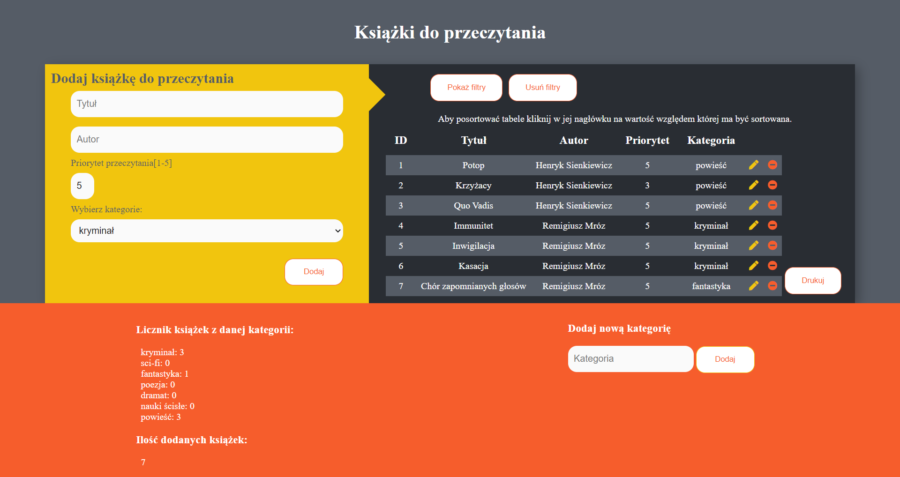

### Moja biblioteka

live: https://budnickip.github.io/myLibrary/

Widok na urządzeniach desktopowych:

Widok na urządzeniach mobilnych:

Możliwość dodawania książek za pomocą formularza - przed dodaniem następuje walidacja, tytuł książki musi mieć conajmniej 1 znak, autor książki musi mieć conajmniej 3 znaki oraz priorytet przeczytania musi być liczbą od 1 do 5.

W przypadku wprowadzenia wartości niespełniających walidację, użytkownik otrzyma odpowiedni komunikat, a pole zawierające błąd zaświeci się na czerwono oraz książka nie zostanie dodana.

Po dodaniu książki, użytkownik może ją usuwać lub edytować, każda zmiana automatycznie modyfikuje naszą listę książek w localstorage. Przy próbie edycji książki, pola również ulegają walidacji, książka nie doda się, jeśli któreś z pól nie przejdzie próby walidacji.

Możliwość dodania nowej kategorii. Nowa kategoria wyświetla się w formularzu, czy też w filtrach.

Tabela może być sortowana po kliknięciu na interesującą nas kategorię(ID, autor, priorytet, kategoria). Przy pierwszym kliknięciu tabela posortuje się rosnąco, przy kolejnym kliknięciu w tą samą kategorię posortuje się malejąco.

Tabela może bić filtrowana, należy wybrać opcję  "pokaż filtry", wybrać interesujące nas ustawienia, a następnie zapisać wybrane filtry. Filtry w każdym momencie można usunąć poprzez kliknięcie przycisku "usuń filtry".

Użytkownik może wydrukować tabelę klikając przycisk "drukuj".

Drag & drop książki - książki można sortować poprzez przeciąganie myszką(lub palcem na urządzeniach dotykowych) i upuszczanie w dowolnej pozycji w tabeli.

Każda nowa funkcjonalność tworzona na oddzielnym branchu.